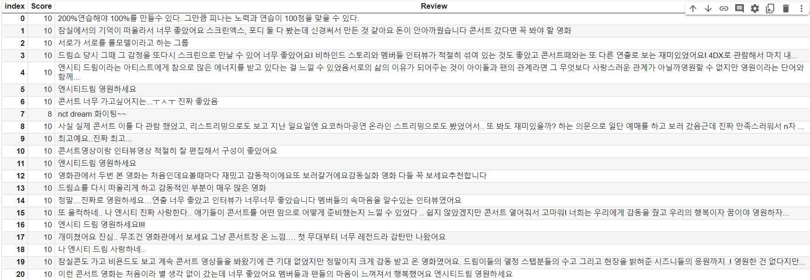

# naver_movie_review.ipynb 

## 프로젝트를 시작하는 방법
` 이 코드는 구글 코랩 기반으로 작성되었습니다.`  
` 코드 상단의 open in colab 버튼을 누르면 코랩 환경에서 작동 가능합니다.`
- 리뷰를 찾고싶은 영화 제목을 입력한다.  

- 입력한 영화 제목이 포함된 모든 영화 정보와 포스터 출력  

- 그 중 원하는 영화의 순서(1~n)를 입력  

- 네이버 영화리뷰 한 페이지 리뷰 크롤링할 때마다 "페이지n 리뷰" 출력  
 
네이버 영화 리뷰 클롤링 결과 확인(데이터 프레임에 데이터 저장하면서 크롤링)

- 리뷰 중 결측치 제거와 리뷰 데이터 개요 출력  

- 리뷰 파일을 csv파일형태로 저장
- 한국어 형태소 분석기 설치
- 실질적인 영화 리뷰에 관련 없는 용어를 제거  
![
- 영화 리뷰 중 빈도수가 높은 단어를 그래프와 wordcloud로 표현  
- 단어 그래프의 한글 깨짐 현상을 해결하기 위해 폰트 설정 코드
- 

- 리뷰들 토큰화 후 불용어 제거
- 출현빈도 높은 단어 wordcloud방식으로 출력

