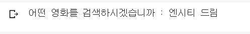
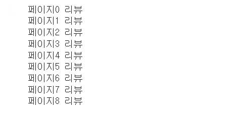
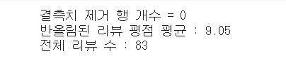

# naver_movie_review.ipynb 

## Description
이 프로젝트는 자연어처리 분야를 연구하는 분들이 데이터를 쉽게 사용할 수 있도록 하기 위해 실행되었다. 
영화 제목을 입력하면 해당 제목의 네이버 영화 리뷰 데이터와 평점을 수집, 저장한 후 딥러닝을 통한 감정분석(0: 부정, 1: 긍정)으로 수집한 리뷰에서 긍정율 측정  

##Environment
google colab  
python 3.8.15   

##Usage of Package

##Reference

` 이 코드는 구글 코랩 기반으로 작성되었습니다.`  
` 코드 상단의 open in colab 버튼을 누르면 코랩 환경에서 작동 가능합니다.` 

## 코드 실행 과정

1. 리뷰를 찾고싶은 영화 제목을 입력한다. 
  

1. 입력한 영화 제목이 포함된 모든 영화 정보와 포스터 출력 
  

1. 그 중 원하는 영화의 순서(1~n)를 입력 
  

1. 네이버 영화리뷰 한 페이지 리뷰 크롤링할 때마다 "페이지n 리뷰" 출력 
  
네이버 영화 리뷰 클롤링 결과 확인(데이터 프레임에 데이터 저장하면서 크롤링) 

1. 리뷰 중 결측치 제거와 리뷰 데이터 개요 출력 
  

1. 리뷰 파일을 csv파일형태로 저장 

1. 한국어 형태소 분석기 설치 

1. 리뷰를 토큰화 후 관련 없는 용어를 제거 
제거 후 남은 용어 예시 
  

1. 영화 리뷰 중 빈도수가 높은 단어를 그래프와 wordcloud로 표현 
 
`아래 이미지는 깃허브가 day모드로 설정해야 세로축의 글자가 보인다.`
 
  

1. 단어 그래프의 한글 깨짐 현상을 해결하기 위해 폰트 설정 코드  

1. 출현빈도 높은 단어 wordcloud방식으로 출력  

1. BERT fine-tuning을 
`코랩 무료 버전으로는 대략 40분~1시간 정도 걸림` 
  

1. 학습된 딥러닝으로 현재 크롤링한 리뷰 데이터에 대한 긍정, 부정 예측 

